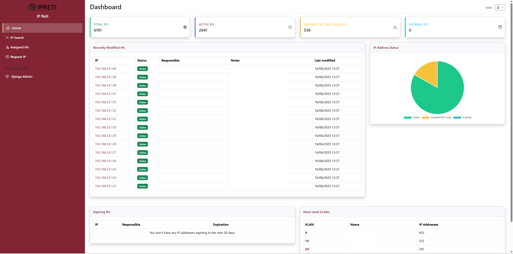

# IPRETI - IP Network Management System

  

This is a Django-based app designed for IP address management of internal networks.



## **Project Overview**

  

A **modern and efficient** IP address management system featuring:

  

-  **Real-time network discovery** via SNMP from routers and firewalls

-  **Advanced analytics** with automatic statistics and historical tracking

-  **Modern web interface** with responsive design and intuitive UX

-  **Full containerization** with Docker Compose for easy deployment

-  **Automated workflows** for IP lifecycle management

-  **REST API** for system integration and automation

  

## **Architecture**

  

The system consists of two main components:

  

### 1. **Django Web Application** (`reti-webapp/`)

-  **Modern web interface** for IP management

-  **REST API** for data access and integrations

-  **User authentication** and role-based access control

-  **Administrative interface** for system management

-  **Real-time statistics** and network overview

  

### 2. **Data Collector Container** (`reti-companion/`)

-  **SNMP collection** from network devices (routers, firewalls, switches)

-  **Automatic synchronization** with Django via REST API

-  **Scheduled tasks** for periodic network scanning

-  **IP lifecycle management** with automatic cleanup and release

  

```

┌─────────────────────┐ API calls ┌─────────────────────┐

│ Django Web App │ ←──────────────→ │ Data Collector │

│ (Port 8000) │ │ Container │

│ │ │ │

│ • Web Interface │ │ • SNMP Discovery │

│ • REST API │ │ • Network Scanning │

│ • User Management │ │ • Auto Cleanup │

│ • Statistics │ │ • IP Lifecycle │

└─────────────────────┘ └─────────────────────┘

│ │

│ │

▼ ▼

┌─────────────────────┐ ┌─────────────────────┐

│ PostgreSQL DB │ │ Network Devices │

│ │ │ │

│ • IP Addresses │ │ • Cisco Routers │

│ • User Data │ │ • Palo Alto FW │

│ • History/Stats │ │ • F5 Load Balancers │

│ • VLAN Config │ │ • PfSense Switches │

└─────────────────────┘ └─────────────────────┘

```

  

## **Quick Start**

  

### Prerequisites

  

- Docker and Docker Compose

- Git

  

### 1. Clone Repository

  

```bash

git  clone  https://github.com/your-username/ip-reti-django.git

cd  ip-reti-django

```

  

### 2. Environment Configuration

  

```bash
 

# Edit configuration

nano  docker-compose.yml

```

  

Key environment variables:

```bash

# Database

DB_NAME=ip_reti_db

DB_USER=postgres

DB_PASSWORD=your_secure_password

  

# Django

DJANGO_SECRET_KEY=your_secret_key_here

DJANGO_DEBUG=False

DJANGO_ALLOWED_HOSTS=localhost,127.0.0.1,your-server.com

  

# Data Collector

DJANGO_API_TOKEN=your_api_token_for_collector

LOG_LEVEL=INFO

```

  

### 3. Network Configuration

  

**CRITICAL: Configure your network devices before deployment**

  

```bash

# Copy configuration template

cp  reti-companion/config/config_example.txt  reti-companion/config/config.py

  

# Edit with your specific network devices

nano  reti-companion/config/config.py

```

  

Update with your actual:

-  **Router IP addresses and SNMP communities**

-  **Firewall credentials and SNMPv3 settings**

-  **F5 Load Balancer file paths**

-  **Django API URL and authentication token**

  

See [Companion Configuration Guide](reti-companion/README.md) for detailed setup instructions.

  

### 4. Deploy

  

```bash

# Start all services

docker-compose  up  -d

  

# Check status

docker-compose  ps

  

# View logs

docker-compose  logs  -f

```

  

### 5. Initial Setup

  

```bash

# Create Django superuser

docker-compose  exec  web  python  manage.py  createsuperuser

  

# Access application

# Web Interface: http://localhost:8000

# Admin Interface: http://localhost:8000/admin

```

  

## **User Guide**

  

### Web Interface Features

  

#### **Dashboard**

-  **Network overview** with real-time statistics

-  **Quick access** to common operations

-  **Recent activity** and system status

  

#### **IP Search and Management**

-  **Advanced search** by IP, MAC, user, or department

-  **Bulk operations** for multiple IP management

-  **Detailed IP information** with history tracking

-  **Assignment management** with user association

  

#### **Network Analytics**

-  **Real-time statistics** per VLAN and department

-  **Usage trends** and capacity planning

-  **Historical data** and activity reports

-  **Export capabilities** for external analysis

  

#### **User Management**

-  **Role-based access control** (Admin, Manager, User)

-  **Department-based filtering** and permissions

-  **Activity tracking** and audit logs

  

### **IP Lifecycle**

  

1.  **Discovery**: Automatically detected via SNMP from network devices

2.  **Assignment**: Assigned to users through web interface or API

3.  **Monitoring**: Continuously monitored for activity status

4.  **Cleanup**: Automatically deactivated when inactive (2+ hours)

5.  **Release**: Automatically released when long-term inactive (30+ days)

  

### **Common Operations**

  

#### Request New IP

1. Navigate to "Request IP" page

2. Select network range (VLAN)

3. Provide MAC address and justification


  

#### Search and Filter IPs

- Use advanced search with multiple criteria

- Filter by status, VLAN, department, user

- Export results to CSV for reporting

  

#### Manage Assignments

- Reassign IPs to different users

- Update responsible person information

- Track assignment history

  

## **API Reference**

  

### Authentication

```bash

# Get API token (Admin interface)

curl  -H  "Authorization: Token your_token_here"  \

http://localhost:8000/api/ips/

```

  

### Common Endpoints

  

#### IP Management

```bash

# List all IPs

GET  /api/ips/

  

# Get specific IP

GET  /api/ips/{ip_address}/

  

# Create new IP

POST  /api/ips/

{

"indirizzo":  "192.168.1.100",

"vlan":  1,

"disponibilita":  "libero"

}

  

# Update IP

PATCH  /api/ips/{ip_address}/

{

"stato":  "attivo",

"mac_address":  "aa:bb:cc:dd:ee:ff"

}

```

  

#### Statistics

```bash

# Network statistics

GET  /api/ips/statistiche/

  

# VLAN usage

GET  /api/vlans/{vlan_id}/statistiche/

```

  

See [API Documentation](API_DOCUMENTATION.md) for complete reference.

  

## **Administration**

  

### Django Admin Interface

  

Access at `http://localhost:8000/admin/` with superuser credentials.

  

#### Key Admin Tasks:

-  **User management** and permissions

-  **VLAN configuration** and ranges

-  **System settings** and API tokens

-  **Bulk IP operations** and data import/export

-  **Monitoring logs** and system health

  

### Data Collector Management

  

```bash

# View collector status

docker-compose  logs  -f  data-collector

  

# Manual collection run

docker-compose  exec  data-collector  python  scripts/data_collector.py  -c  update

  

# Test API connectivity

docker-compose  exec  data-collector  python  test_api.py

```

 
  

## **Monitoring**

### Health Checks

  

```bash

# Application health

curl  http://localhost:8000/health/

  

# Database connectivity

docker-compose  exec  web  python  manage.py  check  --database

  

# Collector status

docker-compose  exec  data-collector  python  test_api.py

```

  

### Log Management

  

```bash

# Application logs

docker-compose  logs  -f  web

  

# Collector logs

docker-compose  logs  -f  data-collector

  

# Database logs

docker-compose  logs  -f  db

```

  

### Performance Monitoring

  

-  **Database queries**: Django Debug Toolbar (development)

-  **API response times**: Built-in Django metrics

-  **Collection statistics**: Collector logs and API endpoints

-  **System resources**: Docker stats and container monitoring

 
  


  


  

  

## **License**

  

This project is licensed under the MIT License. See [LICENSE](LICENSE) file for details.

  

## **Support**

  

### Documentation

- [API Documentation](API_DOCUMENTATION.md)

- [Companion Setup Guide](reti-companion/README.md)

- [Migration Guide](MIGRATION.md)

  
### Supported Devices

  

#### Tested Network Equipment

-  **Cisco**: 6500 Series, ASR, ISR routers

-  **Palo Alto**: All PA-Series firewalls with SNMPv3

-  **F5**: BIG-IP Load Balancers (file-based integration)

-  **PfSense**: All versions with SNMP enabled

  

#### SNMP Requirements

-  **SNMPv2c**: For routers and switches

-  **SNMPv3**: Required for firewalls and security devices

-  **OIDs**: Standard ARP table OIDs (1.3.6.1.2.1.3.1.1.2)

  


  

**Happy IP Management! 🎉**